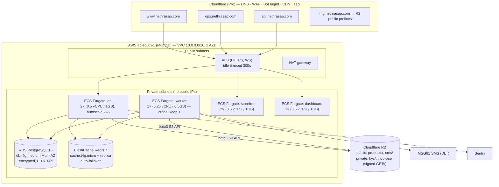

# Cloud Architecture — Nethrasap Platform

*Prepared 2026-08-04. Senior-architect view of how to host the platform from
launch through enterprise scale. Complements (does not replace)
`PRODUCTION-DEPLOY-PLAN.md`: that doc is the step-by-step for the launch tier;
this doc is the decision record and the target architecture the platform
graduates into.*

---

## 0. Workload profile (what we are hosting)

| Component | Runtime shape | Hosting constraint |
|---|---|---|
| FastAPI API + WebSocket hub | Long-lived container, async I/O | Needs WS support end-to-end (LB idle timeouts, no buffering proxies) |
| arq background worker | Always-on container, **cron jobs inside** | Exactly-once-ish crons → keep **1 replica** unless jobs are made shard-safe |
| Redis 7 | Queue + pub/sub backplane + rate limits | Low latency to API/worker; pub/sub means WS already scales horizontally |
| PostgreSQL 16 | Deeply relational: 39 models, row-locked inventory, triggers | Managed Postgres, **same region as compute** (~1ms) |
| Storefront + Dashboard (Next.js SSR) | Stateless containers | `NEXT_PUBLIC_API_BASE` baked at build time |
| Object storage | S3-compatible (boto3) | Public prefixes (products/cms) + private signed GETs (KYC, invoices) |
| SMS OTP | MSG91 + DLT sender ID | India-only concern; provider-side, no infra impact |
| Payments | COD-only (locked); Razorpay dormant | RBI payment-data localization is Razorpay's problem, not ours |

Non-negotiables inherited from the codebase:

- **One registrable domain** (`www.` / `ops.` / `api.` / `img.`) — the guest-cart
  cookie is `SameSite=Lax`; platform subdomains (`*.onrender.com`,
  `*.run.app`) are separate PSL sites and silently break carts.
- **Migrations run before traffic** (`alembic upgrade head` + RBAC seed) — the
  pre-deploy hook pattern must survive whatever platform we move to.
- **Audience is India.** Every latency and residency decision flows from this.

---

## 1. The three tiers (decision matrix)

| | **Tier 1 — Launch** (now) | **Tier 2 — Enterprise** (recommended target) | **Tier 3 — Scale** (only if earned) |
|---|---|---|---|
| Compute | Render (Singapore), Docker | **AWS ECS Fargate, ap-south-1 Mumbai** | EKS (Kubernetes) |
| Database | Supabase Postgres (Singapore) | **RDS PostgreSQL 16 Multi-AZ** | Aurora PostgreSQL + read replicas |
| Redis | Render Key Value | **ElastiCache Redis (replication group)** | ElastiCache cluster mode |
| Edge/CDN/WAF | Cloudflare free | **Cloudflare (Pro) → ALB** | Same |
| Object storage | Cloudflare R2 | **Cloudflare R2 (keep — zero egress)** | Same |
| User latency (India) | ~70–100ms to SG | **~10–30ms to Mumbai** | Same |
| Data residency | Singapore | **India (DPDP-friendly)** | India |
| Ops cost/mo (prod) | ~$40–80 | **~$250–400** | $1,500+ |
| When | Now → first real traction | Revenue/enterprise clients/compliance asks | >~50k DAU or a platform team exists |

**Recommendation:** launch on Tier 1 exactly as already planned (it is wired
and cheap), and build Tier 2 as the deliberate next step — not a VPS in Mumbai
(the archived §10 option in the deploy plan). A VPS saves ~$150/mo but costs
you Multi-AZ failover, managed backups/PITR, IAM, and audit posture — the
things an enterprise healthcare-supply client will actually ask about.
**GCP Cloud Run (asia-south1)** is the credible alternative to Tier 2 (§7);
choose it only if serverless economics beat reserved Fargate for your traffic.

---

## 2. Tier 2 target architecture (AWS Mumbai)



### 2.1 Networking

- **VPC** `10.0.0.0/16`, two AZs (`ap-south-1a`, `ap-south-1b`). Three subnet
  tiers per AZ: public (ALB, NAT), private-app (ECS tasks), private-data
  (RDS, ElastiCache). Nothing in private tiers has a public IP.
- **Security groups as the only firewall**: ALB ← Cloudflare IP ranges only
  (published list, keep it updated via IaC); ECS ← ALB SG; RDS/Redis ← ECS SGs
  only. No CIDR-wide rules.
- **NAT**: one NAT gateway to start (~$35/mo + data); add the second-AZ NAT
  only when the availability math justifies $70/mo. Add **VPC endpoints** for
  ECR, S3, CloudWatch Logs, Secrets Manager — they cut NAT data charges and
  keep image pulls off the internet.
- **ALB**: HTTPS listener (ACM cert for `*.nethrasap.com`), host-header rules
  → api / storefront / dashboard target groups. **Idle timeout 300s** and
  target group `stickiness off` — the WS hub uses Redis pub/sub, any api task
  can serve any socket. Health checks: `/api/v1/health` (api), `/` (fronts).

### 2.2 Compute (ECS Fargate)

- One ECS cluster, four services from the existing two images
  (`Dockerfile.backend`, `Dockerfile.frontend`) pushed to **ECR** — the
  Dockerfiles need zero changes.
- **api**: min 2 tasks across AZs, target-tracking autoscaling on CPU 60% and
  ALB RequestCountPerTarget. Graceful drain 60s for WS close.
- **worker**: **exactly 1 task** (arq crons: `dispatch_outbox`, heartbeat are
  not shard-safe). If throughput ever demands more, split cron settings into a
  dedicated singleton worker and scale the queue-consumer worker separately.
- **migrations**: an ECS **run-task** (same backend image, command
  `alembic upgrade head && python -m scripts.seed_rbac`) executed by the
  pipeline *before* the api service update — the Render `preDeployCommand`
  pattern, reproduced.
- Fargate over EC2-backed ECS: no hosts to patch — the entire OS-patching and
  capacity story disappears. Buy a **Compute Savings Plan** once usage is
  stable (~30–40% off).

### 2.3 Data

- **RDS PostgreSQL 16**, `db.t4g.medium` (2 vCPU/4GB) **Multi-AZ**, gp3 50GB
  autoscaling to 200GB, encrypted (KMS), automated backups + **PITR 14 days**,
  deletion protection on. `asyncpg` connects direct (no RDS Proxy needed at
  this pool size; revisit past ~10 api tasks). Weekly snapshot copied to
  `ap-southeast-1` for region-loss DR.
- **ElastiCache Redis 7**, `cache.t4g.micro` primary + replica,
  auto-failover, AOF not needed (queue jobs are re-enqueueable via the outbox
  pattern already in the worker; verify before relying on this).
- **Object storage stays on Cloudflare R2.** The code is S3-compatible via
  `STORAGE_*` env vars, R2 has **zero egress fees**, and `img.nethrasap.com`
  already fronts the public prefixes with Cloudflare CDN. Moving to S3 buys
  nothing and adds egress cost. (If the client mandates single-vendor AWS:
  S3 + CloudFront, same env vars, one-day change.)

### 2.4 Security & compliance

- **Cloudflare in front of everything**: WAF managed rules, bot fight mode,
  rate limiting at the edge (in addition to the app's Redis rate limits), TLS
  1.2+. ALB accepts traffic only from Cloudflare IPs + an
  `X-Origin-Verify` shared-secret header rule (defeats direct-to-ALB bypass).
- **Secrets Manager** for `DATABASE_URL`, `JWT_SECRET`, `SMS_API_KEY`,
  `STORAGE_*`, Razorpay keys — injected into task definitions as `secrets:`,
  never plain env in IaC. Rotation: JWT and DB password annually or on
  personnel change.
- **KMS** encryption at rest everywhere (RDS, ElastiCache, ECR, logs, R2 uses
  its own). KYC documents and invoices stay in **private** R2 prefixes served
  only via short-lived signed GETs (already implemented).
- **IAM**: one task role per service, least privilege (api/worker get R2 creds
  via Secrets Manager, CloudWatch write; nothing else). Humans via IAM
  Identity Center (SSO), no long-lived access keys.
- **Account structure** (AWS Organizations): `nethrasap-prod`,
  `nethrasap-staging`, `nethrasap-shared` (ECR, tooling). Blast-radius
  isolation and clean cost separation per account.
- **DPDP Act 2023**: hosting in Mumbai keeps customer PII + KYC data in India
  — not strictly mandated today, but it is the answer enterprise healthcare
  clients want to hear, and it future-proofs against sector rules. CloudTrail
  on in all accounts (audit trail), GuardDuty + AWS Config baseline.

### 2.5 Observability

- **Logs**: ECS → CloudWatch Logs (structlog already emits JSON), 30-day
  retention hot, archive to S3 after.
- **Metrics**: the app already serves Prometheus on `/metrics` — scrape with
  the **ADOT collector sidecar → Amazon Managed Prometheus → Grafana**
  (managed or a $0 Grafana Cloud free tier at this scale). RED dashboards per
  service + RDS/Redis/ALB CloudWatch metrics.
- **Errors**: set `SENTRY_DSN` — the SDK is already installed and dormant.
- **Alerts** (SNS → Slack/phone): api 5xx rate, p95 latency, ALB unhealthy
  hosts, RDS CPU/storage/connections, Redis evictions, worker heartbeat
  missing (the worker already writes one every 30s — alarm on its absence),
  outbox depth, budget anomaly.
- **Uptime**: external synthetic checks (Better Uptime / Pingdom) on
  `www`, `ops`, `api/health` from Indian probes.

### 2.6 CI/CD (GitHub Actions)

```
PR      → lint + typecheck + pytest (backend target=test image) + next build
main    → build backend/frontend images → push ECR (git-sha tags)
        → deploy STAGING: run-task migrate → update services → smoke tests
release → deploy PROD: run-task migrate → rolling update api/worker/fronts
          (circuit breaker on: auto-rollback on failed health checks)
```

- **OIDC federation** GitHub→AWS (no stored AWS keys in GitHub).
- ECS deployment **circuit breaker + rollback** enabled on every service.
- Frontends: because `NEXT_PUBLIC_API_BASE` is baked at build time, staging
  and prod need **separate image builds** (build-arg differs) — tag as
  `storefront-<sha>-staging` / `-prod`.
- All infra in **Terraform** (state in S3 + DynamoDB lock, one workspace per
  account):

```
infra/terraform/
  modules/        network/  ecs-service/  rds/  redis/  observability/
  envs/
    staging/      main.tf  (small: 1 api task, db.t4g.small single-AZ)
    prod/         main.tf
```

### 2.7 Environments

| Env | Where | Sizing | Data |
|---|---|---|---|
| dev | docker-compose (unchanged) | — | seeded |
| staging | AWS staging account | 1× api, 1× worker, single-AZ `db.t4g.small`, no replica Redis (~$90–120/mo) | anonymized subset, **never** prod KYC |
| prod | AWS prod account | §2.2–2.3 | real |

### 2.8 DR targets

- **RPO ≤ 5 min** (PITR WAL), **RTO ≤ 1 hour** (Multi-AZ failover is
  automatic and ~60–120s; RTO 1h covers full-region rebuild from Terraform +
  cross-region snapshot).
- Quarterly game day: restore latest snapshot into staging, run smoke tests.
  A backup that has never been restored is a hope, not a backup.

---

## 3. Cost model (monthly, approximate, on-demand ap-south-1)

| Item | Prod | Staging |
|---|---:|---:|
| Fargate (api 2×, worker 1×, fronts 3×) | $95 | $35 |
| ALB | $25 | $20 |
| RDS `db.t4g.medium` Multi-AZ + 50GB gp3 | $95 | $25 (small, single-AZ) |
| ElastiCache micro ×2 | $25 | $12 |
| NAT gateway + data | $40 | $35 |
| CloudWatch / AMP / misc | $25 | $10 |
| Cloudflare Pro (one zone) | $25 | — |
| R2 (10GB + ops) | $2 | — |
| **Total** | **~$330** | **~$140** |

Savings Plan after 3 stable months: prod drops to ~$270. Compare: Tier 1 is
~$60. The delta buys Mumbai latency, Multi-AZ, PITR, IAM/audit, and India
residency — this is what "enterprise" costs, and it is still small.

---

## 4. GCP alternative (if not AWS)

Cloud Run (asia-south1) is the one serious alternative: api/storefront/
dashboard as Cloud Run services (WS supported, 60-min socket timeout — the
client must reconnect, verify the WS hub's reconnect handles this), worker as
Cloud Run with `min-instances=1`, Cloud SQL Postgres 16 (HA), Memorystore
Redis via VPC connector, migrations as a Cloud Run Job. Roughly $180–280/mo.
Pros: true scale-to-zero on the fronts, less network plumbing. Cons: Memorystore
+ VPC-connector friction, weaker enterprise-account story than AWS Orgs, and
the 60-min WS ceiling. Pick it only if the team already knows GCP.

Azure (Container Apps, Central India) is viable but third choice here —
weakest managed-Postgres + Redis latency story for this stack in India.

---

## 5. Migration plan (Tier 1 → Tier 2)

Zero-drama because the domain layer never changes — Cloudflare stays the front
door for `www/ops/api/img` throughout.

1. **Phase 0 (now):** go live on Render+Supabase per the existing plan. Add
   the things that transfer: Sentry DSN, uptime checks, R2, budget alerts.
2. **Phase 1:** stand up AWS staging via Terraform; point CI at it; run the
   full smoke + load suite there for two weeks.
3. **Phase 2:** stand up AWS prod. Migrate Postgres with
   `pg_dump | pg_restore` during a maintenance window (data volumes at this
   stage make logical replication overkill — revisit if >30 min of dump time).
4. **Phase 3:** flip Cloudflare DNS records from Render to the ALB (proxied
   records = instant cutover, instant rollback). Keep Render warm for 72h,
   then decommission.
5. **Trigger for Phase 1:** first enterprise client security questionnaire,
   sustained real traffic, or Supabase/Render bills crossing ~$150/mo —
   whichever comes first.

---

## 6. Explicitly rejected

- **VPS in Mumbai** (archived plan §10): cheaper, but you become the SRE —
  no Multi-AZ, no managed PITR, no IAM story. Wrong trade for healthcare supply.
- **Kubernetes now**: 4 services and one worker do not need EKS. Revisit at
  Tier 3 with a platform team.
- **MongoDB / re-platforming data**: already rejected in the deploy plan;
  the schema is deeply relational and Postgres 16 is a locked decision.
- **Multi-region active-active**: COD commerce in one country does not need
  it; cross-region snapshots cover region loss.
